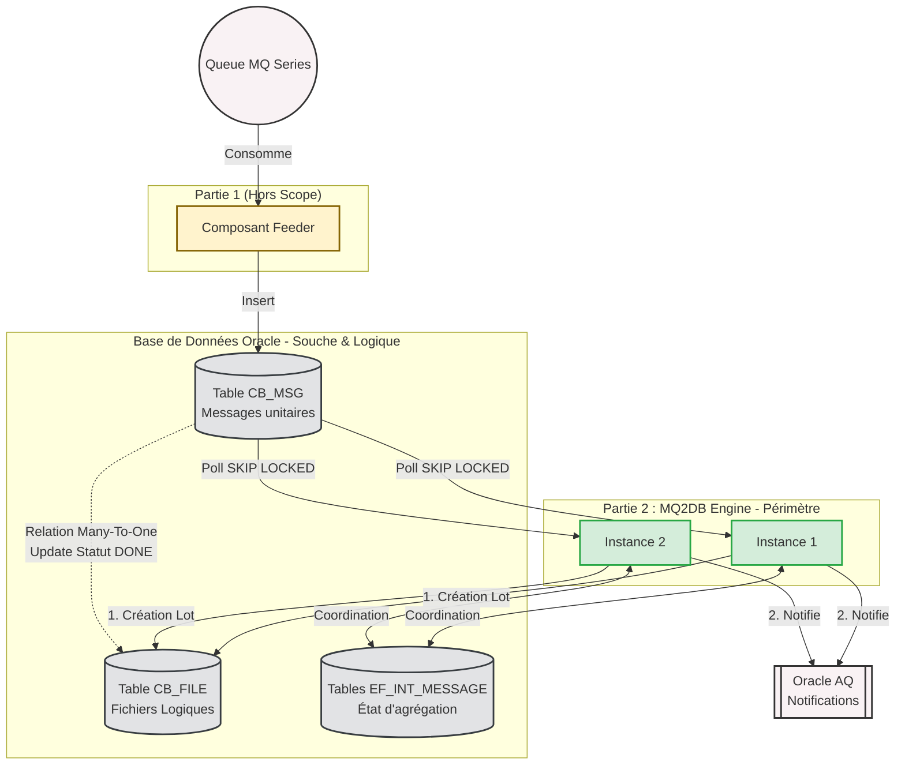
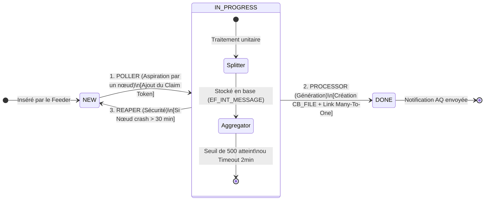

Voici la documentation mise à jour, prête à être intégrée dans Jira ou Confluence. Elle formalise la transition de l’ancien système (fichiers temporaires physiques) vers le nouveau paradigme (fichiers logiques en base) et clarifie la frontière de responsabilités entre le *Feeder* et le *MQ2DB Engine*.

---

# 🚀 [EPIC] Conception et Architecture du socle MQ2DB Engine

## 1. 🎯 Contexte et Existant (As-Is)

Historiquement, le système s’appuie sur un composant monolithique qui écoute une file d’attente **MQ Series**. Au fil de l’eau, les messages lus sont écrits dans des **fichiers physiques temporaires** (fichiers tampons) sur le disque du serveur afin de constituer des lots.

Ce fonctionnement présente des limites architecturales et opérationnelles :

- **Adhérence forte au disque local** : difficile (voire impossible) de garantir un clustering *Actif-Actif* robuste si l’état de lotissement dépend de fichiers locaux.
- **Coûts I/O et contention disque** : dégradation des performances lors des pics (écritures fréquentes, flush, contention FS).
- **Reprise sur incident complexe** : en cas de crash serveur pendant l’écriture d’un fichier temporaire, la reconstruction de l’état (lot partiellement écrit, index, offsets) est coûteuse et risquée.

---

## 2. 🌟 Le Nouveau Paradigme (To-Be)

La nouvelle solution vise à supprimer totalement ces fichiers tampons physiques en utilisant la **Base de Données relationnelle comme zone tampon (souche)**. Les lots ne sont plus construits sur le disque, mais de manière **logique** en base de données, ce qui permet de rendre l’état durable, partageable et cluster-friendly.

Pour des raisons de séparation des responsabilités, la nouvelle architecture est scindée en **deux composants distincts** :

1. **Le MQ Feeder (Hors scope de cette Epic)**  
   - Responsable exclusif de l’écoute de la queue MQ Series.  
   - Insère les messages bruts directement dans la base de données : table générique `CB_MSG` et table métier correspondante.

2. **Le MQ2DB Engine (Le Kernel — Périmètre de cette Epic)**  
   - Le cœur du réacteur : il scrute la base de données, récupère les messages asynchrones et gère la logique de regroupement (lotissement).  
   - **Le concept de “Fichier Logique”** : au lieu de créer un fichier physique temporaire, l’Engine crée une ligne dans la table `CB_FILE` qui représente le lot. Tous les messages (`CB_MSG`) validés pour ce lot sont mis à jour avec l’ID de ce fichier (relation *Many-to-One*).  
   - Une fois le fichier logique clos, l’Engine publie une notification afin de prévenir les systèmes avals.

---

## 3. 🚧 Problématiques et Défis Techniques de l’Engine

Ce nouveau moteur de lotissement (`MQ2DB Engine`) doit répondre à des contraintes de classe Entreprise :

- **Haute Disponibilité (Actif-Actif)** : l’Engine doit tourner sur plusieurs serveurs simultanément pour répartir la charge et éviter le point de défaillance unique.
- **Concurrence d’accès (Zéro doublon)** : si deux nœuds lisent la base, ils ne doivent jamais embarquer le même message dans deux lots différents (exactly-once au niveau du lotissement).
- **Tolérance aux pannes** : si un serveur crashe au milieu de la constitution d’un lot, l’état d’agrégation ne doit pas être perdu et aucun message ne doit rester bloqué.
- **Haute Performance** : absorber des pics de charge extrêmes (ex : 100 000 messages) sans congestionner la base Oracle et sans générer d’effets de bord (verrous prolongés, scans coûteux, starvation).

---

## 4. 💡 Architecture de la Solution (MQ2DB Engine)

Pour relever ces défis, le Kernel MQ2DB s’appuie sur le framework **Spring Integration** adossé à un cluster de base de données (JDBC Message Store). L’Engine se décompose en **4 grands sous-systèmes** :

1. **Le Poller (Aspirateur & Verrou)**  
   - Scrute les messages en base au statut `NEW`.  
   - Utilise la clause Oracle avancée `FOR UPDATE SKIP LOCKED` pour verrouiller un lot de messages sans bloquer les autres instances.  
   - Marque les messages avec un *Claim Token* (UUID) et passe leur statut à `IN_PROGRESS`.

2. **L’Agrégateur (La Gare de Triage)**  
   - Piloté par Spring Integration, il reçoit les messages et les trie dans des “seaux” partagés en cluster (par Flux et par Branche).  
   - Stocke et coordonne l’état d’agrégation dans le JDBC Message Store.  
   - Attend que le seuil soit atteint (ex : 500 msgs) **ou** qu’un Timeout expire (ex : 2 min) pour libérer un lot cohérent.

3. **Le Batch Processor (Le Générateur Logique)**  
   - Réceptionne le lot libéré (batch).  
   - Insère une ligne dans `CB_FILE` (le fichier logique).  
   - Associe cette ligne à tous les `CB_MSG` du lot (relation N..1), met à jour le statut à `DONE`, et déclenche une notification via Oracle AQ.

4. **Les Reapers (L’Auto-Guérison)**  
   - Processus de fond (watchdogs) qui surveillent les anomalies et l’anti-blocage.  
   - Si des messages restent `IN_PROGRESS` trop longtemps (ex : crash matériel, arrêt brutal d’une instance, rollback non finalisé), le Reaper “nettoie” ces orphelins et les remet à `NEW` pour être repris par le cluster sain.

---

## 5. 🗺️ Diagrammes d’Architecture

### A. Vue Globale : Du MQ au Fichier Logique

### B. Cycle de Vie d’un Message (Workflow)

