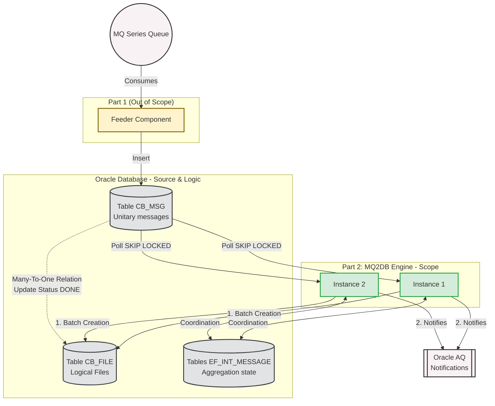
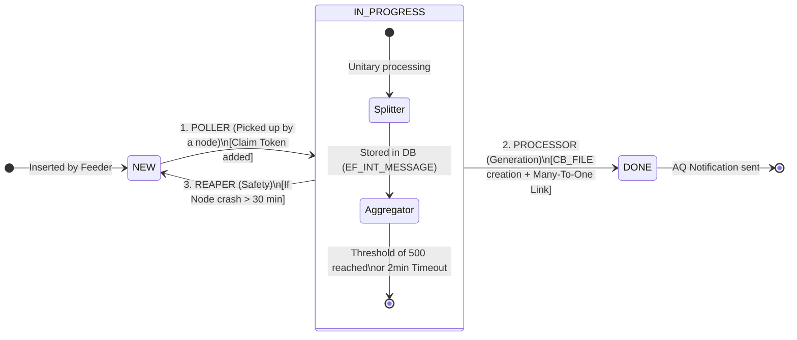

Here is the updated documentation, ready to be integrated into Jira or Confluence. It formalizes the transition from the old system (physical temporary files) to the new paradigm (logical files in database) and clarifies the boundary of responsibilities between the *Feeder* and the *MQ2DB Engine*.

---

# 🚀 [EPIC] MQ2DB Engine Core Design and Architecture

## 1. 🎯 Context and Existing System (As-Is)

Historically, the system relies on a monolithic component that listens to an **MQ Series** queue. As they are read, messages are written to **temporary physical files** (buffer files) on the server's disk to form batches.

This operation has architectural and operational limitations:

- **Strong dependency on local disk**: difficult (if not impossible) to guarantee robust *Active-Active* clustering if the batching state depends on local files.
- **I/O costs and disk contention**: performance degradation during peaks (frequent writes, flush, FS contention).
- **Complex incident recovery**: in case of a server crash during the writing of a temporary file, reconstructing the state (partially written batch, index, offsets) is costly and risky.

---

## 2. 🌟 The New Paradigm (To-Be)

The new solution aims to completely eliminate these physical buffer files by using the **Relational Database as a buffer zone (source)**. Batches are no longer built on disk, but **logically** within the database, which makes the state durable, shareable, and cluster-friendly.

For separation of concerns, the new architecture is split into **two distinct components**:

1. **The MQ Feeder (Out of scope for this Epic)**  
   - Exclusively responsible for listening to the MQ Series queue.  
   - Inserts raw messages directly into the database: generic `CB_MSG` table and the corresponding business table.

2. **The MQ2DB Engine (The Kernel — Scope of this Epic)**  
   - The heart of the system: it polls the database, retrieves asynchronous messages, and manages the grouping logic (batching).  
   - **The “Logical File” concept**: instead of creating a temporary physical file, the Engine creates a row in the `CB_FILE` table representing the batch. All messages (`CB_MSG`) validated for this batch are updated with this file's ID (*Many-to-One* relationship).  
   - Once the logical file is closed, the Engine publishes a notification to inform downstream systems.

---

## 3. 🚧 Technical Issues and Challenges of the Engine

This new batching engine (`MQ2DB Engine`) must meet Enterprise-class constraints:

- **High Availability (Active-Active)**: the Engine must run on several servers simultaneously to balance the load and avoid a single point of failure.
- **Concurrency Control (Zero Duplicates)**: if two nodes read the database, they must never include the same message in two different batches (exactly-once at the batching level).
- **Fault Tolerance**: if a server crashes in the middle of building a batch, the aggregation state must not be lost and no message should remain stuck.
- **High Performance**: absorb extreme load peaks (e.g., 100,000 messages) without congesting the Oracle database and without generating side effects (prolonged locks, costly scans, starvation).

---

## 4. 💡 Solution Architecture (MQ2DB Engine)

To meet these challenges, the MQ2DB Kernel relies on the **Spring Integration** framework backed by a database cluster (JDBC Message Store). The Engine is broken down into **4 major subsystems**:

1. **The Poller (Vacuum & Lock)**  
   - Polls messages in the database with `NEW` status.  
   - Uses the advanced Oracle clause `FOR UPDATE SKIP LOCKED` to lock a batch of messages without blocking other instances.  
   - Marks messages with a *Claim Token* (UUID) and changes their status to `IN_PROGRESS`.

2. **The Aggregator (The Sorting Station)**  
   - Driven by Spring Integration, it receives messages and sorts them into shared clustered “buckets” (by Stream and by Branch).  
   - Stores and coordinates the aggregation state in the JDBC Message Store.  
   - Waits for the threshold to be reached (e.g., 500 msgs) **or** for a Timeout to expire (e.g., 2 min) to release a consistent batch.

3. **The Batch Processor (The Logical Generator)**  
   - Receives the released batch.  
   - Inserts a row in `CB_FILE` (the logical file).  
   - Associates this row with all `CB_MSG` in the batch (N..1 relationship), updates the status to `DONE`, and triggers a notification via Oracle AQ.

4. **The Reapers (Self-Healing)**  
   - Background processes (watchdogs) that monitor anomalies and anti-blocking.  
   - If messages remain `IN_PROGRESS` for too long (e.g., hardware crash, abrupt instance shutdown, non-finalized rollback), the Reaper “cleans up” these orphans and resets them to `NEW` to be picked up by the healthy cluster.

---

## 5. 🗺️ Architecture Diagrams

### A. Global View: From MQ to Logical File

### B. Message Lifecycle (Workflow)

